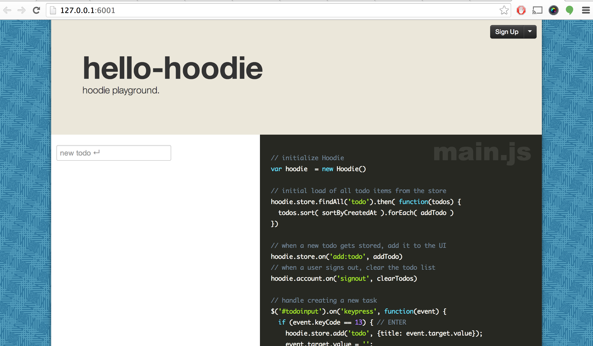
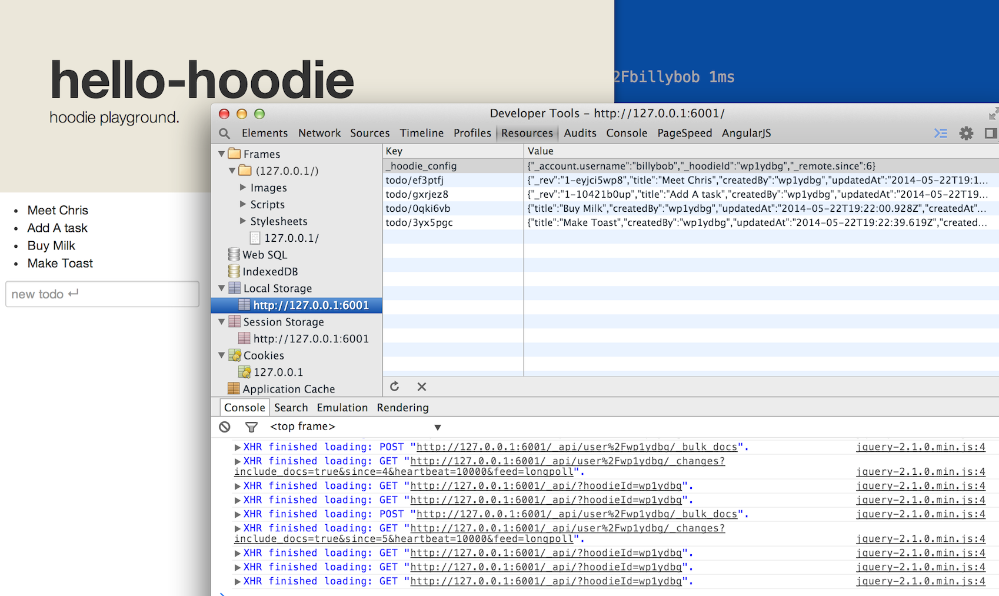

hello-hoodie
============

A Hoodie Example Application - Hello World Tutorial


#Install Hoodie and Pre-Requisites

Following: [http://hood.ie/#installation](http://hood.ie/#installation)

```
  brew update
  brew install git
  brew install node
  brew install couchdb
```

That all took 5 minutes or so!

```
  npm install -g hoodie-cli

  npm install -g local-tld
```

#Creating a New Hoodie App

```

$ hoodie new hello-hoodie

.d$b.  .d$b.  .d$$$$$$b.    .d$$$$$$b.  .d$$$$$$b.  .d$b..d$$$$$$$$b.
$$$$$..$$$$$.$$$$$$$$$$$b .$$$$$$$$$$$b $$$$$$$$$$b $$$$$$$$$$$$$$$P'
$$$$$$$$$$$$d$$$$$$$$$$$$bd$$$$$$$$$$$$b$$$$$$$$$$$b$$$$$$$$$$$$$$$b.
$$$$$$$$$$$$Q$$$$$$$$$$$$PQ$$$$$$$$$$$$P$$$$$$$$$$$P$$$$$$$$$$$$$$$P'
$$$$$´`$$$$$'$$$$$$$$$$$$''$$$$$$$$$$$$'$$$$$$$$$$P $$$$$$$$$$$$$$$b.
'Q$P'  'Q$P'  'Q$$$$$$P'    'Q$$$$$$P'  'Q$$$$$$$P  'Q$P''Q$$$$$$$$P'

Version: 0.4.10 (node v0.10.21, npm 1.3.11, platform: darwin)

[hoodie] Updated package.json
[hoodie] fetching npm dependencies
[hoodie] removing .git folder
[hoodie] Error installing dependencies:

Something's wrong here...

Try running the following commands to resolve possible issues:

  hoodie cache clean

  npm cache clean

If none of the above works, run "hoodie new hello-hoodie --verbose"
and come talk to us on freenode #hoodie 

$ hoodie cache clean
[hoodie] cleaning cache...
[hoodie] done
$ npm cache clean
```

__Editor's Note:__
I think this was because I had an already existing folder and an 
empty git repo (for this demo) so I just deleted the folder completely, 
I ```git init```'d and re-added the remote after ```hoodie new```
succeeded

Trying again:

```

$ hoodie new hello-hoodie

.d$b.  .d$b.  .d$$$$$$b.    .d$$$$$$b.  .d$$$$$$b.  .d$b..d$$$$$$$$b.
$$$$$..$$$$$.$$$$$$$$$$$b .$$$$$$$$$$$b $$$$$$$$$$b $$$$$$$$$$$$$$$P'
$$$$$$$$$$$$d$$$$$$$$$$$$bd$$$$$$$$$$$$b$$$$$$$$$$$b$$$$$$$$$$$$$$$b.
$$$$$$$$$$$$Q$$$$$$$$$$$$PQ$$$$$$$$$$$$P$$$$$$$$$$$P$$$$$$$$$$$$$$$P'
$$$$$´`$$$$$'$$$$$$$$$$$$''$$$$$$$$$$$$'$$$$$$$$$$P $$$$$$$$$$$$$$$b.
'Q$P'  'Q$P'  'Q$$$$$$P'    'Q$$$$$$P'  'Q$$$$$$$P  'Q$P''Q$$$$$$$$P'

Version: 0.4.10 (node v0.10.21, npm 1.3.11, platform: darwin)

[hoodie] Updated package.json
[hoodie] fetching npm dependencies
[hoodie] removing .git folder
[hoodie] preparing hello-hoodie ...
[hoodie] created project at /work/projects/hoodie/hello-hoodie/
[hoodie] Installed all dependencies

You can now start using your hoodie app

  cd hello-hoodie
  hoodie start

```

Success!

```
  $ cd hoodie-hello
  $ hoodie start
```

And the app starts and a browser opens pointing to ```http://127.0.0.1:6001/```



#Running the App With Connectivity

The javascript app communicates to the server and stores a local copy of data in the local storage


#Running the App With Connectivity

The javascript app continuously tries to connect to the server, but still works locally, storing
data in local storage and marking items as dirty with typename/keyvalue


#Reconnecting

```


2014-05-22T19:28:54.692Z [] GET 200 /_api/ 2ms
2014-05-22T19:28:54.711Z [] GET 200 /_api/user%2Fwp1ydbg/_changes 1ms
2014-05-22T19:28:54.733Z [] GET 200 /_api/user%2Fwp1ydbg/_changes 1ms
2014-05-22T19:28:54.738Z [] POST 200 /_api/user%2Fwp1ydbg/_bulk_docs 1ms
2014-05-22T19:28:54.772Z [] GET 200 /_api/user%2Fwp1ydbg/_changes 0ms
2014-05-22T19:28:54.876Z [] GET 200 /_api/user%2Fwp1ydbg/_changes 0ms
2014-05-22T19:29:19.873Z [] GET 200 /_api/ 0ms
2014-05-22T19:29:22.874Z [] GET 200 /_api/user%2Fwp1ydbg/_changes 0ms
2014-05-22T19:29:47.878Z [] GET 200 /_api/ 0ms
2014-05-22T19:29:50.880Z [] GET 200 /_api/user%2Fwp1ydbg/_changes 0ms
2014-05-22T19:30:15.883Z [] GET 200 /_api/ 0ms
2014-05-22T19:30:18.886Z [] GET 200 /_api/user%2Fwp1ydbg/_changes 0ms
2014-05-22T19:30:43.890Z [] GET 200 /_api/ 0ms
2014-05-22T19:30:46.889Z [] GET 200 /_api/user%2Fwp1ydbg/_changes 0ms
2014-05-22T19:31:11.912Z [] GET 200 /_api/ 1ms
2014-05-22T19:31:14.911Z [] GET 200 /_api/user%2Fwp1ydbg/_changes 0ms
2014-05-22T19:31:39.915Z [] GET 200 /_api/ 0ms
2014-05-22T19:31:42.918Z [] GET 200 /_api/user%2Fwp1ydbg/_changes 0ms

```

When the server is found again, the changes are synced with the server over ajax and dirty
flags are cleared


